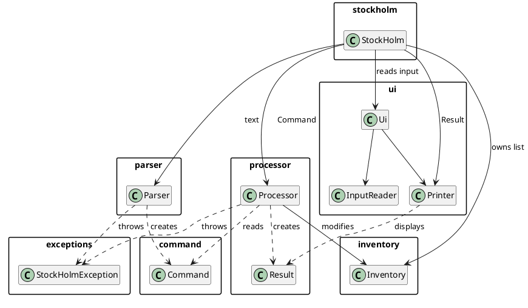
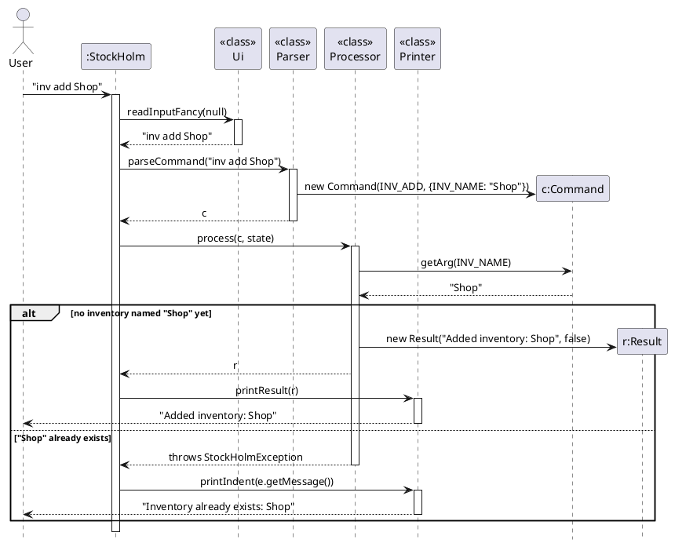
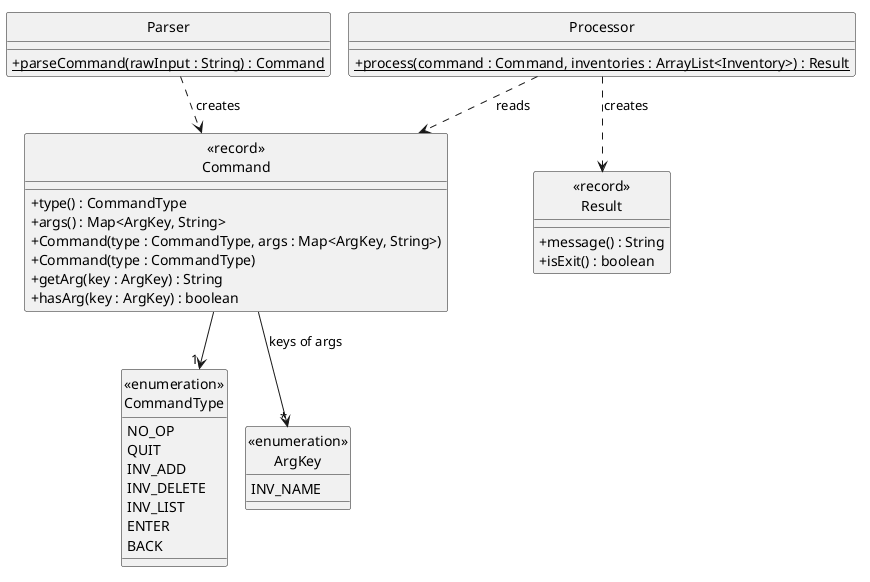
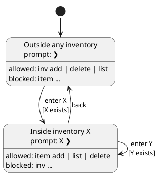

# Developer Guide

## Acknowledgements

* Project structure and build setup adapted from the [SE-EDU](https://se-education.org) project template.
* [Gson](https://github.com/google/gson): JSON library, added for the upcoming save/load feature (`Storage`).
* [JUnit 5](https://junit.org/junit5/): unit testing.
* [Checkstyle](https://checkstyle.org/): code style checks.
* [Gradle Shadow plugin](https://gradleup.com/shadow/): packages the app into a single runnable `stockholm.jar`.

## Design & implementation

### Architecture



StockHolm is a command-line app built around one loop in `StockHolm.main`:

1. **Read**: `Ui.readInputFancy(inventoryName)` shows the prompt and returns the line the user typed.
2. **Parse**: `Parser.parseCommand(line)` turns the text into a `Command`.
3. **Process**: `Processor.process(command, state)` runs the command against the `AppState` and returns a `Result`.
4. **Print**: `Printer.printResult(result)` shows the result. The loop stops once `result.isExit()` is `true`.

Each step has one job, so the classes stay small and easy to test:

| Component | Job | Never does |
|---|---|---|
| `Parser` | Checks **syntax** (unknown command, missing argument, malformed number) | Look at inventory data |
| `Processor` | Enforces **business rules** (e.g. no duplicate inventory names) | Read input, parse text, or print |
| `Printer` | Decides **how** output looks | Decide what happened |
| `AppState` | **Holds the data**: all inventories and the current one | Contain business rules |
| `StockHolm` | Creates the `AppState` and runs the loop | — |

`Parser` and `Processor` hold no state of their own; all their methods are `static`.

Any user-facing error is thrown as a `StockHolmException`, from either the Parser or the Processor.
The main loop catches it in a single place and prints its message, so you never need to print errors yourself.

### Flow of one command

The sequence diagram below shows `inv add Shop`, both when it succeeds and when the inventory already exists.



### Command component

Package `stockholm.command`: `Command`, `CommandType`, `ArgKey`.



A `Command` is an **op code** plus **named arguments**:

* `CommandType` is the op code: which action to run (e.g. `ITEM_ADD`).
* `ArgKey` names an argument (e.g. `ITEM_NAME`). Using an enum instead of strings means a mistyped key is a compile error.
* `args` is a `Map<ArgKey, String>` holding the arguments.

```java
// Command with arguments
Command add = new Command(CommandType.INV_ADD, Map.of(ArgKey.INV_NAME, "Shop"));
// Command without arguments
Command quit = new Command(CommandType.QUIT);

add.getArg(ArgKey.INV_NAME);   // "Shop"
add.hasArg(ArgKey.INV_NAME);   // true
quit.hasArg(ArgKey.INV_NAME);  // false
quit.getArg(ArgKey.INV_NAME);  // throws IllegalStateException
```

* Use `getArg` for **required** arguments. The Parser guarantees they are present, so a missing one is a bug, and
  `getArg` throws `IllegalStateException` to make it obvious.
* Use `hasArg` to check **optional** arguments before reading them, e.g. `--type` and `--count` of `item add`.
* `Command` is immutable: it is a `record`, and its map is copied on construction, so it cannot change afterwards.

Rules for arguments:

* **Values are strings.** The Parser checks their syntax (e.g. that a count is a positive number), and the Processor
  converts them when it uses them, e.g. `Double.parseDouble(command.getArg(ArgKey.ITEM_COUNT))`.
* **Commands carry names or positions, not objects.** To refer to an existing inventory or item, put its name (or its
  number in a list) in the command; the Processor looks up the object (see `Processor.findInventory` and
  `Inventory.findItem`). The Parser has no access to the data, so it cannot supply the real object.

### Parser component

`stockholm.parser.Parser` has one public method, `parseCommand(String rawInput)`.

* It splits the input into the command word and the rest (`splitFirstWord`), then `switch`es on the command word.
  Commands with subcommands get their own helper: `parseInvCommand` for `inv add|delete|list`, and
  `parseItemCommand` for `item add|list|delete`. `stock` is parsed by `parseStock`.
* Blank input becomes `NO_OP`, so pressing Enter does nothing.
* **Aliases** live in the `ALIASES` map (e.g. `bye`, `exit`, `close` → `quit`). Add new aliases there and nowhere else.
* `requireArg(value, label, usage)` throws a `StockHolmException` such as
  `Missing item name. Usage: item add NAME [--type=TYPE] [--count=COUNT]` if a required argument is empty.
  Use it for every required argument.

**Options.** `item add` takes a name followed by `--name=value` options:

```
item add "A4 Paper Case" --type="Stationery" --count=2
```

* A name in double quotes may contain spaces. An unquoted name runs until the first `--`.
* `splitNameAndOptions(arguments, label, usage)` separates a leading (optionally quoted) name from the options after
  it. It is shared by `item add` and `stock`; reuse it for any command of the form `NAME [--option=value]...`.
* `parseOptions(text, usage)` reads any number of options into a `Map<String, String>`. Values may be quoted to contain
  spaces (`--type="Office Supplies"`). It rejects text that is not an option and options given twice.
  The caller then rejects option names it does not know. Reuse `parseOptions` for future commands with options.
* Numbers are checked with regular expressions before they are put into the command: `DECIMAL` for counts (positive,
  e.g. `2` or `2.5`; no sign or exponent) and `WHOLE_NUMBER` for item numbers.
  `requirePositiveDecimal(value, label)` wraps the `DECIMAL` check; it is used for `--count` and `--below`.

### Processor component

`stockholm.processor.Processor` has one public method, `process(Command command, AppState state)`,
which `switch`es on `command.type()` and calls one private handler per command:

```java
case ITEM_ADD:
    return addItem(command, requireInsideInventory(state));
```

* A handler either returns a `Result`, or throws a `StockHolmException` if a business rule is broken
  (e.g. `"Inventory already exists: Shop"`).
* `Result(String message, boolean isExit)` is a `record`. Use an empty message to print nothing,
  and `isExit = true` only for `QUIT`.
* Command types the Processor does not handle fall through to `default` and throw `"Command not supported yet: ..."`.

**Where commands are allowed.** The user is either outside all inventories, or inside one after `enter`:



These guards enforce this, and should be reused by new commands:

* `requireOutsideInventory(state)` throws `You are inside Shop. Use back to leave it first.`
* `requireInsideInventory(state)` returns the current `Inventory`, or throws
  `You are not inside an inventory. Use enter NAME first.`
* `requireNamedOrCurrentInventory(command, state, usage)` is for commands that work **anywhere** and take an optional
  inventory name (e.g. `stock`). It returns the inventory named by `ArgKey.INV_NAME` if the command has one, otherwise
  the current inventory, and throws `Missing inventory name. Usage: <usage>, or enter an inventory first.` if there
  is neither. It never changes the current inventory.

To look up an inventory by name, use `requireInventory(name, inventories)`, which throws `No such inventory: NAME`,
or `findInventory`, which returns `null` instead.

**Item rules** (in `addItem` and `deleteItem`):

* `item add` without `--count` adds 1; without `--type`, the type is empty and not shown.
* Adding an item whose name already exists **merges** it: the counts are added together. If a `--type` is given that
  differs from the existing item's type, the command is rejected so a type is never silently lost.
* `item delete N` uses the **one-based** numbers shown by `item list`; the handler converts to a zero-based index for
  `Inventory.removeItem`.
* Names are compared case-sensitively, so `Pen` and `pen` are different items (and inventories).

**Stock levels** (in `showStock` and `showLowStock`):

* `stock` works **anywhere**: it gets its inventory from `requireNamedOrCurrentInventory`, so stock can be checked
  without entering an inventory.
* Items keep the numbers shown by `item list`, so a number seen in `stock` can be passed straight to `item delete`.
* The total number of units is summed with `BigDecimal`, so decimal counts add up exactly (`0.1 + 0.2` gives `0.3`).
* With `--below=COUNT`, only items whose count is **strictly** below `COUNT` are listed (an item with exactly `COUNT`
  is not low), and the totals line is left out.

### State component

`stockholm.state.AppState` holds everything the app remembers between commands:

* `getInventories()`: the list of all inventories (modifiable).
* `getCurrentInventory()`: the inventory the user has entered, or `null`. `isInsideInventory()` checks this.
* `enterInventory(Inventory)` and `leaveInventory()` change the current inventory. Entering while already inside
  another inventory switches directly.

Only the Processor should change the state. `StockHolm` reads `getCurrentInventory()` to show its name in the prompt.

### Inventory component

Package `stockholm.inventory`:

* `Inventory(String name)` is a named list of items, kept in the order they were added.
    * `getName()` is also how inventories are looked up.
    * `addItem(Item)`, `findItem(String name)` (returns `null` if missing), and `removeItem(int index)` (zero-based).
    * `getItems()` returns a **read-only** view; change items only through the methods above.
    * `addOrder(Order)` stores an order for this inventory without changing its stock.
      `getOrders()` returns a **read-only** view of orders in creation order.
* `Item(String name, String type, double count)`: the count is a `double` so items measured in e.g. kilograms work.
    * `addCount(double)` increases the count when an item is merged.
    * `removeCount(double)` reduces validated stock using decimal subtraction to avoid rounding residue.
    * `toString()` gives the display form, e.g. `A4 Paper Case (Stationery) x2`, leaving out `( )` if the type is empty.
    * `Item.formatCount(double)` shows counts without a trailing `.0` (`2.0` → `2`, `2.5` → `2.5`).

### Order component

Package `stockholm.order`:

- `Order` holds an `Item` and its `OrderState`, accessible through `getItem()` and `getState()`. New orders start in `WAITING_APPROVAL`.
- `ImportOrder` extends `Order` and is stored in the current inventory by the Processor.
- `import NAME [--type=TYPE] [--count=COUNT]` is parsed by `parseImport`, while `item add` is parsed separately by `parseItemAdd`. Both reuse `parseOptions` and provide their own usage hints.
- The Processor uses `requireInsideInventory`, creates a separate item with a default count of 1 and an empty type, and stores a new `ImportOrder`.
- Existing items and stock counts stay unchanged. Repeated imports create separate orders.
- `export ITEM_ID [COUNT]` uses the one-based item number displayed by `item list`. The Parser checks the item
  number and optional positive, finite decimal count; the Processor resolves the item in the current inventory.
- `ExportOrder` extends `Order`. The Processor rejects counts above available stock, deducts the exported count
  immediately, and stores a separate item snapshot in an `WAITING_APPROVAL` export order. An omitted count exports
  all current stock. Items with no remaining stock are removed, so subsequent item numbers are renumbered.
- Rejected exports leave stock and orders unchanged. Repeated exports use the remaining stock, and changes to
  inventory items do not alter previous orders' recorded counts.
- The normal `Result` and Printer flow displays the item's name, type, and formatted count.
- `order list` is parsed by `parseOrderCommand` and handled by `listOrders` using `requireInsideInventory`.
  It lists only the current inventory's orders in creation order, showing their kind, state, item name, type, and
  formatted count. It does not change orders or stock. Empty inventories report `No orders in NAME yet.`
- Approval and delivery transitions, dates, and notes are not implemented yet.

### UI component

Package `stockholm.ui`:

* `InputReader.readLine()` reads one raw line from standard input. It returns `"quit"` when input ends
  (e.g. Ctrl+D), so the app always exits cleanly.
* `Printer` is the **only** class that writes to the screen:
    * `printResult(Result)` prints the message, or nothing if it is empty.
    * `printIndent(String)` prints indented text; every line of a multi-line message is indented.
    * `printIndentedError(String)` does the same, but writes to standard error.
    * `printBar()` prints a horizontal line as wide as the terminal (`$COLUMNS`), or 100 characters if that is unknown.
    * `printPrompt()` prints `❯ `; `printPrompt(String)` prints the current inventory first, e.g. `Shop ❯ `.
* `Ui` combines `Printer` and `InputReader` calls for common screens:
  `readInputFancy(String inventoryName)` (the prompt between two bars; pass `null` when outside an inventory),
  `printStarter()`, and `printEnding()`.

### Not implemented yet

These exist as placeholders, so avoid depending on their current shape:

* `storage.Storage`: will save data to `./data/stockholm.json` using Gson. **Until then, all data is lost on exit.**
* `order.TransferOrder`; order approval and delivery workflows, dates, and notes.

### Adding a new command

Example: a hypothetical `item rename INDEX NEW_NAME` command, used inside an inventory.

1. **Op code**: add `ITEM_RENAME` to `CommandType`, with a Javadoc comment showing its syntax.
2. **Argument keys**: reuse existing keys where they mean the same thing (`ITEM_INDEX`, `ITEM_NAME`), and add new ones
   to `ArgKey` only when needed.
3. **Parse it** in `Parser`: add a `case "rename"` to `parseItemCommand` and a `parseItemRename` helper. Check the
   syntax with `requireArg` and the `WHOLE_NUMBER` pattern, then build the command:
   ```java
   return new Command(CommandType.ITEM_RENAME, Map.of(
           ArgKey.ITEM_INDEX, index,
           ArgKey.ITEM_NAME, newName));
   ```
4. **Process it** in `Processor`: add a `case ITEM_RENAME` that calls a private handler with
   `requireInsideInventory(state)`. The handler checks the index is in range and the new name is not taken,
   throws a `StockHolmException` if not, and returns a `Result` with the message to show.
5. **Test it**: add cases to `ParserTest` (valid input and each syntax error) and `ProcessorTest`
   (success and each broken rule, including running it outside an inventory). Helpers such as `invCommand`,
   `itemAdd` and `enterNewShop` in those tests keep the tests short.
6. **Document it** in the User Guide, and add a manual test case below.

You never need to touch `StockHolm`, `Printer` or `Result` to add a command.

### Testing and conventions

* Use **Java 25**. If your default JDK is different, run `export JAVA_HOME=/path/to/jdk-25` first.
* Run all tests and style checks with `./gradlew test checkstyleMain checkstyleTest`.
* Test classes mirror the main package structure, e.g. `src/test/java/stockholm/parser/ParserTest.java`.
* Test method names follow `methodName_condition_expectedResult`, e.g. `parseCommand_invAddWithoutName_throwsException`.
* To test console output, redirect `System.out` to a `ByteArrayOutputStream` in `@BeforeEach` and restore it in
  `@AfterEach` (see `PrinterTest`).
* Diagram sources are in `docs/diagrams/*.puml`. After editing one, regenerate the PNG with
  `java -jar plantuml.jar -tpng -o ../images docs/diagrams/*.puml`
  ([download plantuml.jar](https://plantuml.com/download)).


## Product scope
### Target user profile

People who need to manage multiple inventories and keep track of the history of changes to them.

### Value proposition

StockHolm lets users manage multiple inventories from a fast, keyboard-driven CLI, 
with an approval-based order workflow that keeps stock accurate and a full audit trail of every change.

## User Stories

|Version| As a ... | I want to ... | So that I can ...|
|--------|----------|---------------|------------------|
|v1.0|new user|see usage instructions|refer to them when I forget how to use the application|
|v1.0|inventory manager|view the stock levels of any inventory without entering it|check stock quickly from anywhere|
|v1.0|inventory manager|list only the items that are running low|know what to restock|
|v2.0|user|find a to-do item by name|locate a to-do without having to go through the entire list|

## Non-Functional Requirements

{Give non-functional requirements}

## Glossary

* *glossary item* - Definition

## Instructions for manual testing

> These instructions are a starting point for testers; you are encouraged to try more cases, especially unusual input.
> Expected messages are shown exactly as the app prints them.

### Launch and shutdown

1. **Prerequisites**: Java 25 (`java -version`).
2. **Build** the jar from the project folder with `./gradlew shadowJar`. It is created at `build/libs/stockholm.jar`.
3. **Launch** with `java -jar build/libs/stockholm.jar`.
   Expected: `Hello, Welcome to StockHolm, your inventory manager program`, then a bar and the prompt `❯`.
4. **Exit** with `bye` (or `quit`, `exit`, `close`). Expected: `See you next time`, and the app ends.
   Pressing Ctrl+D (end of input) also exits cleanly.

> **Data is not saved yet.** Every launch starts with no inventories, so each test below assumes you run its setup
> commands first.

### Sample data

Paste these lines one at a time after launching to get a ready-made state for the tests:

```
inv add Main Warehouse
inv add Shop
enter Shop
item add "A4 Paper Case" --type="Stationery" --count=2
item add Rice --count=2.5 --type=Food
item add Blue Pen
```

Expected after `item list`:

```
Items in Shop:
1. A4 Paper Case (Stationery) x2
2. Rice (Food) x2.5
3. Blue Pen x1
```

### Managing inventories

Run these **outside** any inventory (the prompt is `❯` with no name).

1. **Adding**
    1. `inv add Main Warehouse` → `Added inventory: Main Warehouse`. Names may contain spaces.
    2. `inv add Shop` twice → the second time: `Inventory already exists: Shop`.
    3. `inv add` → `Missing inventory name. Usage: inv add NAME`
2. **Listing**: `inv list` → `Inventories:` followed by a numbered list in the order added.
   With no inventories: `No inventories yet.`
3. **Deleting**
    1. `inv delete Shop` → `Deleted inventory: Shop`; it no longer appears in `inv list`.
    2. `inv delete Ghost` → `No such inventory: Ghost`
4. **Wrong subcommand**: `inv` or `inv rename Shop` → `Usage: inv add|delete|list [NAME]`

### Entering and leaving an inventory

Setup: `inv add Shop` and `inv add Main Warehouse`.

1. `enter Shop` → `Entered inventory: Shop`, and the prompt becomes `Shop ❯`.
2. `enter Main Warehouse` while inside Shop → `Entered inventory: Main Warehouse`; the prompt switches directly.
3. `back` → `Left inventory: Main Warehouse`, and the prompt becomes `❯` again.
4. `back` again (outside) → `You are not inside an inventory. Use enter NAME first.`
5. `enter Ghost` → `No such inventory: Ghost`; the prompt does not change.
6. `enter` → `Missing inventory name. Usage: enter NAME`

**Location rules:**

1. Inside `Shop`, run `inv list`, `inv add Office` or `inv delete Shop`.
   Expected for each: `You are inside Shop. Use back to leave it first.`, and nothing changes.
2. Outside any inventory, run `item list`, `item add Pen` or `item delete 1`.
   Expected for each: `You are not inside an inventory. Use enter NAME first.`

### Adding items

Setup: `inv add Shop`, then `enter Shop`.

1. **All options**: `item add "A4 Paper Case" --type="Stationery" --count=2` → `Added item: A4 Paper Case (Stationery) x2`
2. **Options in any order, decimal count**: `item add Rice --count=2.5 --type=Food` → `Added item: Rice (Food) x2.5`
3. **No options** (count defaults to 1, no type): `item add Blue Pen` → `Added item: Blue Pen x1`
4. **Quoted type with spaces**: `item add "Office Chair" --type="Office Supplies" --count=1`
   → `Added item: Office Chair (Office Supplies) x1`
5. **Merging** an existing item (after test 1): `item add "A4 Paper Case" --count=3`
   → `Added 3 to existing item: A4 Paper Case (Stationery) x5`. `item list` still shows it only once.
6. **Merging with a different type** (after test 2): `item add Rice --type=Grain`
   → `Item already exists with a different type: Rice (Food) x2.5. Leave out --type or use the same type.`
   The count stays at 2.5.
7. **Invalid input**. Each is rejected and nothing is added:

| Input | Expected message |
|---|---|
| `item add` | `Missing item name. Usage: item add NAME [--type=TYPE] [--count=COUNT]` |
| `item add "Unclosed --count=2` | `Missing closing quote in item name. Usage: ...` |
| `item add Pen --count=0` | `Count must be a positive number, e.g. 2 or 2.5: 0` |
| `item add Pen --count=abc` | `Count must be a positive number, e.g. 2 or 2.5: abc` |
| `item add Pen --colour=blue` | `Unknown option --colour. Usage: ...` |
| `item add Pen --count=1 --count=2` | `Option given more than once: --count` |
| `item add "Pen" blue` | `Invalid option: blue. Usage: ...` |

### Creating import orders

Setup: `inv add Shop`, then `enter Shop`.

1. `import "A4 Paper Case" --type=Stationery --count=2` prints:
   ```text
   Import order created:
   Item name: A4 Paper Case
   Item type: Stationery
   Item count: 2
   ```
   `item list` still reports `No items in Shop yet.` because the order awaits approval.
2. `import Pen` prints the name `Pen`, an empty type, and count `1`.
3. `import Rice --count=2.5 --type=Food` prints count `2.5` and type `Food`.
4. `item add Rice --type=Food --count=5`, then `import Rice --type=Food --count=2`.
   `item list` still shows `Rice (Food) x5`.
5. `back`, then `import Pen` reports `You are not inside an inventory. Use enter NAME first.`
6. **Invalid input**. Each is rejected and no order is created:

| Input | Expected message |
|---|---|
| `import` | `Missing item name. Usage: import NAME [--type=TYPE] [--count=COUNT]` |
| `import "Unclosed --count=2` | `Missing closing quote in item name. Usage: ...` |
| `import Pen --count=0` | `Count must be a positive number, e.g. 2 or 2.5: 0` |
| `import Pen --count=abc` | `Count must be a positive number, e.g. 2 or 2.5: abc` |
| `import Pen --colour=blue` | `Unknown option --colour. Usage: ...` |
| `import Pen --count=1 --count=2` | `Option given more than once: --count` |
| `import "Pen" blue` | `Invalid option: blue. Usage: ...` |

### Creating export orders

Setup: `inv add Shop`, then `enter Shop`, then `item add Rice --type=Food --count=2.5`.

1. `export 1 1` prints:
   ```text
   Export order created:
   Item name: Rice
   Item type: Food
   Item count: 1
   ```
   `item list` shows `1. Rice (Food) x1.5`. `order list` shows an export order in `WAITING_APPROVAL`.
2. `export 1 2` reports `Cannot export 2 of Rice; only 1.5 available.` Stock and orders stay unchanged.
3. `export 1` exports the remaining 1.5. `item list` reports `No items in Shop yet.` The two export orders
   retain counts 1 and 1.5. Giving the exact remaining count explicitly has the same effect.
4. `export 1` in the empty inventory reports
   `No item number 1. Shop has 0 item(s); use item list to see them.`
5. `export`, `export 0`, `export abc`, `export 1 0`, `export 1 -1`, `export 1 NaN`, and `export 1 2 3` are rejected.
6. `back`, then `export 1` reports `You are not inside an inventory. Use enter NAME first.`
7. `enter Shop`, then `item add Rice --count=0.3`, then run `export 1 0.1` and `export 1 0.2`.
   The item is removed without a rounding residue, and both orders retain their individual counts.

### Listing orders

Setup: `inv add Shop`, then `enter Shop`.

1. `order list` reports `No orders in Shop yet.`
2. `import Rice --type=Food --count=2.5`, then `import Pen`, then `order list` prints:
   ```text
   Orders in Shop:
   1. Import order
      State: WAITING_APPROVAL
      Item name: Rice
      Item type: Food
      Item count: 2.5
   2. Import order
      State: WAITING_APPROVAL
      Item name: Pen
      Item type:
      Item count: 1
   ```
   `item list` still reports `No items in Shop yet.`
3. `back`, then `order list` reports `You are not inside an inventory. Use enter NAME first.`
4. `inv add Warehouse`, then `enter Warehouse`, then `order list` reports `No orders in Warehouse yet.`
   `enter Shop`, then `order list` shows the two original orders again.
5. `order`, `order add`, and `order list Shop` each report `Usage: order list`.

### Viewing stock levels

Setup: the [sample data](#sample-data), then `back` (you are outside all inventories).

1. **Named inventory from outside**: `stock Shop` →
   ```
   Stock levels in Shop:
   1. A4 Paper Case (Stationery) x2
   2. Rice (Food) x2.5
   3. Blue Pen x1
   Total: 3 item(s), 5.5 unit(s)
   ```
   The prompt stays `❯`: `stock` does not enter the inventory.
2. **Current inventory**: `enter Shop`, then `stock` → the same output as test 1.
3. **Another inventory from inside**: while inside Shop, `stock Main Warehouse` → `No items in Main Warehouse yet.`,
   and the prompt stays `Shop ❯`.
4. **Low stock**: `stock Shop --below=2.5` →
   ```
   Items in Shop below 2.5:
   1. A4 Paper Case (Stationery) x2
   3. Blue Pen x1
   ```
   Rice (exactly 2.5) is not listed. `stock Shop --below=1` → `No items in Shop below 1.`
5. **Invalid input**. Each is rejected:

| Input | Expected message |
|---|---|
| `stock` (outside) | `Missing inventory name. Usage: stock [NAME] [--below=COUNT], or enter an inventory first.` |
| `stock Ghost` | `No such inventory: Ghost` |
| `stock Shop --below=0` | `Threshold must be a positive number, e.g. 2 or 2.5: 0` |
| `stock Shop --above=3` | `Unknown option --above. Usage: stock [NAME] [--below=COUNT]` |
| `stock "Main Warehouse` | `Missing closing quote in inventory name. Usage: stock [NAME] [--below=COUNT]` |

### Listing and deleting items

Setup: the [sample data](#sample-data) (you are inside Shop with 3 items).

1. **Listing**: `item list` → `Items in Shop:` followed by the numbered items, as in the sample data.
   In an inventory with no items (e.g. `enter Main Warehouse`, then `item list`): `No items in Main Warehouse yet.`
2. **Deleting**: `item delete 2` → `Deleted item: Rice (Food) x2.5`.
   Then `item list` shows the remaining items **renumbered** from 1: `1. A4 Paper Case ...`, `2. Blue Pen x1`.
3. **Number out of range**: `item delete 9` → `No item number 9. Shop has 2 item(s); use item list to see them.`
4. **Invalid number**:

| Input | Expected message |
|---|---|
| `item delete 0` | `Item number must be a positive whole number: 0` |
| `item delete abc` | `Item number must be a positive whole number: abc` |
| `item delete` | `Missing item number. Usage: item delete INDEX` |
| `item edit 1` | `Usage: item add\|list\|delete ...` |

### Other input

1. Pressing Enter on an empty line does nothing; the prompt is shown again.
2. `dance` → `Unknown command: dance`
3. Commands are case-sensitive: `QUIT` → `Unknown command: QUIT`

### Running many commands at once (optional)

To repeat a test quickly, put one command per line in a text file and send it as input:

```
java -jar build/libs/stockholm.jar < commands.txt
```

The typed commands are not echoed in this mode, so only the prompts and responses appear.
End the file with `bye`; if you don't, the app still exits when the input runs out.
